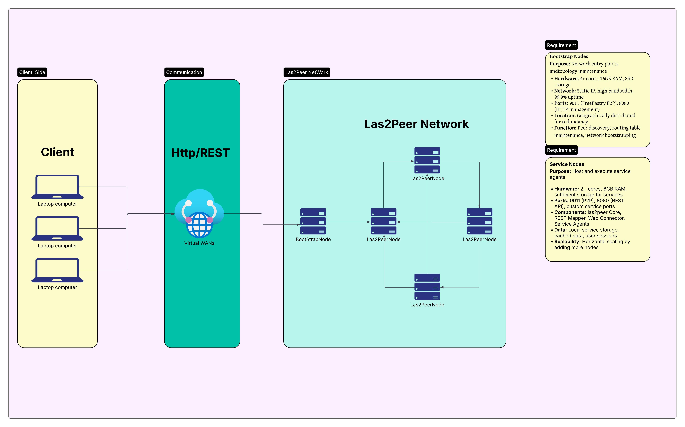
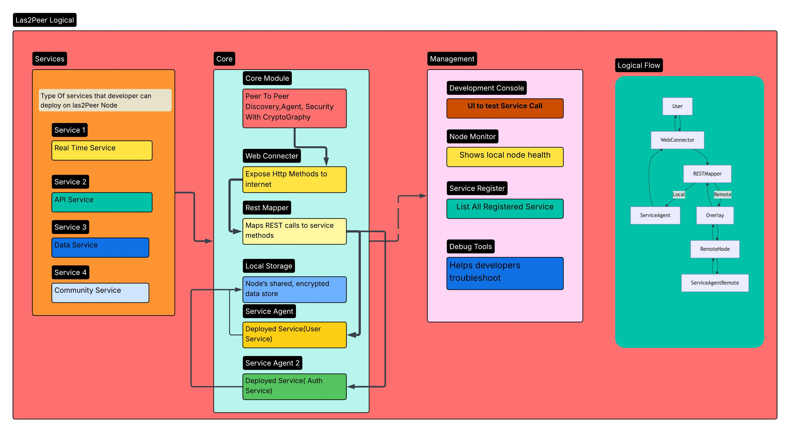
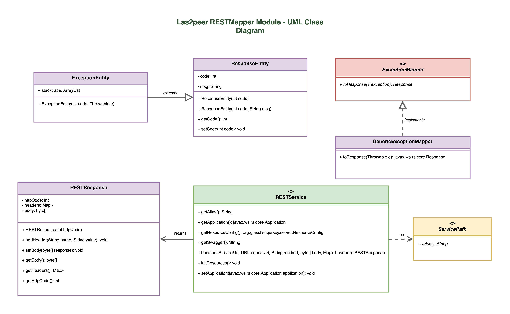
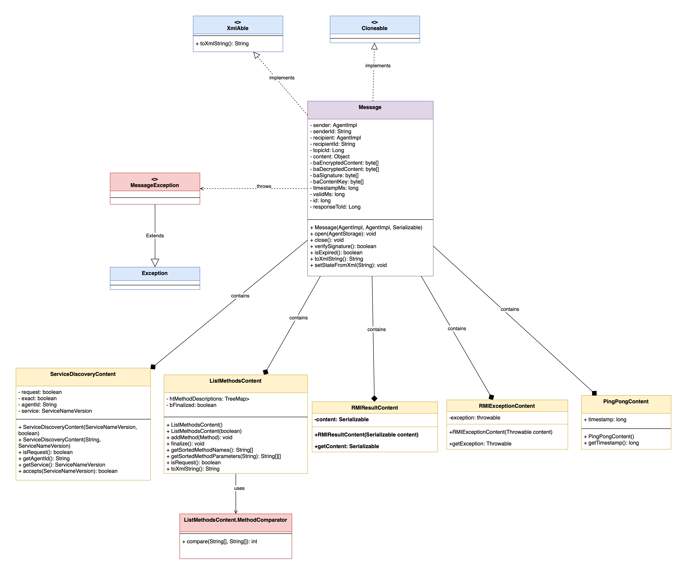
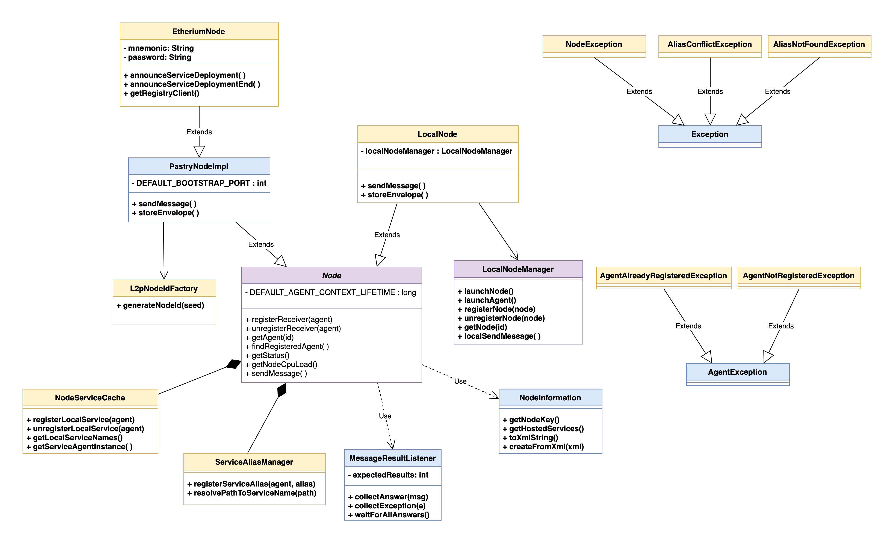
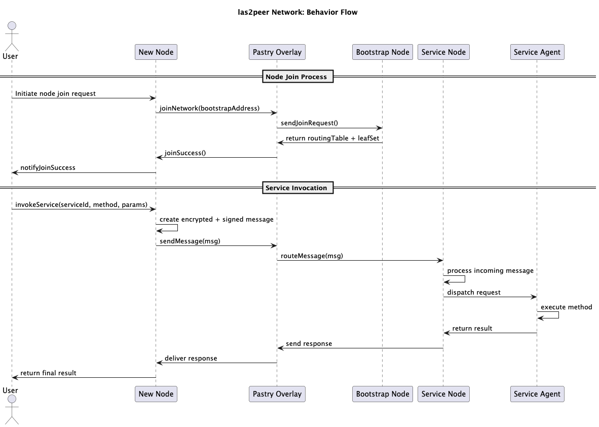
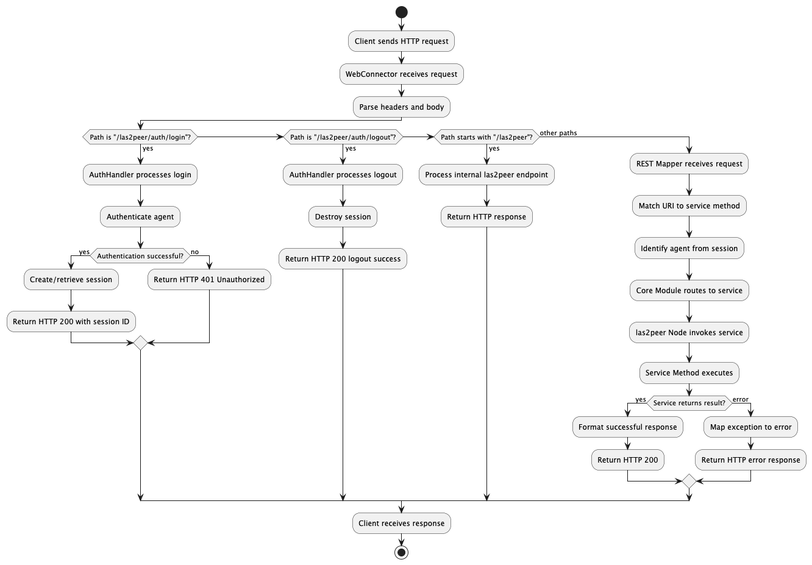
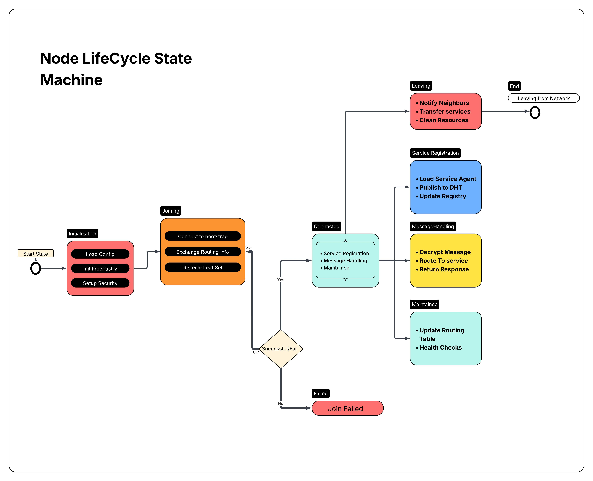

# las2peer Framework World Machine Model

## Authors
* Swan Htet Aung Phyo
* Aung Zayar Moe
* Michal Rowski
* Alexander Rosol

## 1. Business Goal

las2peer enables decentralized microservice development for community information systems, eliminating centralized dependencies through peer-to-peer networks. Primary focus: educational environments and community services.

### 1.1 Glossary of Terms

| Concept | Description |
|---------|-------------|
| Developer | Software engineer creating community services using las2peer framework |
| Service Agent | Autonomous software entity encapsulating service logic in P2P network |
| Node | Network peer hosting services and participating in P2P operations |
| Service Consumer | Application or user accessing community services via REST or P2P |
| Envelope | Encrypted data container for secure inter-agent communication |
| FreePastry | Underlying P2P library handling network routing and communication |
| Bootstrap Node | Entry point helping new nodes join the P2P network |

## 2. Developer Functional Scope

Developers create community services using Java 17 framework compatible across Windows, Linux, macOS. Development process: use las2peer template project, extend Service base class, implement annotated methods, configure properties, build JAR packages.

Deployment involves starting nodes and registering service agents. Services become available across P2P networks with agent-based authentication using cryptographic identities.

### 2.1 Developer Profile
- Service ownership and deployment history
- Node configuration and network participation
- Development environment with IDE integration
- Access to logging and debugging tools
- Service versioning capabilities

### 2.2 Development Tools
- **Getting Started** – tutorials for service development
- **API Documentation** – JavaDoc references and Swagger integration
- **Service Templates** – template project for rapid development
- **Testing Tools** – local testing and debugging capabilities
- **Settings** – service configuration and documentation access

## 3. Network Participant Roles

### 3.1 Service Consumers
Access community services through:
- REST API via Web Connector
- Direct P2P communication with service agents
- WebSocket connections for real-time communication

### 3.2 Node Operators
Maintain network infrastructure by:
- Hosting computational resources for service execution
- Maintaining P2P connections and message routing
- Contributing storage and processing capacity

### 3.3 Service Providers
Contribute to community ecosystem by:
- Developing community-focused services
- Providing documentation and examples
- Supporting deployed services
- Engaging with las2peer developer community

## 4. Technical Architecture

### 4.1 Core Framework Components

**Core Module** – P2P networking, agent framework, message handling, security layer, node management

**REST Mapper Module** – HTTP/REST integration, translates web requests to P2P messages

**Web Connector Module** – web server capabilities, static content, WebSocket support, Swagger integration

### 4.2 Deployment Scenarios
- **Development Environment** – local testing with single/multiple nodes
- **Community Networks** – educational and community service deployments
- **Research Networks** – academic and research project deployments

### 4.3 Security Model
- **Cryptographic Identity** – unique agent/node authentication
- **Envelope Encryption** – secure inter-agent communication
- **Service-level Permissions** – basic access control for community services

---

# Logical and Physical Infrastructure

---

---

# Class Diagram

## REST Mapper Module

---

## Communication Module

---

## Peer to Peer Communication and Discovery

---

# Action Diagrams

## Client and Las2Peer Communication Sequence Diagram

----

## Las2Peer Execution and Client Interaction Activity Diagram

a
---
## Node LifeCycle State Machine

# las2peer Documentation Summary

##  [Concepts Overview](https://github.com/rwth-acis/las2peer/wiki/Concepts-Overview)

##  [Code Structure](https://github.com/rwth-acis/las2peer/wiki/Code-Structure)

## [Service Discovery](https://github.com/rwth-acis/las2peer/wiki/Service-Discovery)

---

##  [Shared Storage](https://github.com/rwth-acis/las2peer/wiki/Shared-Storage)

