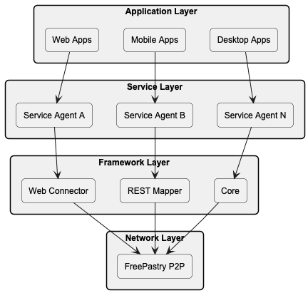
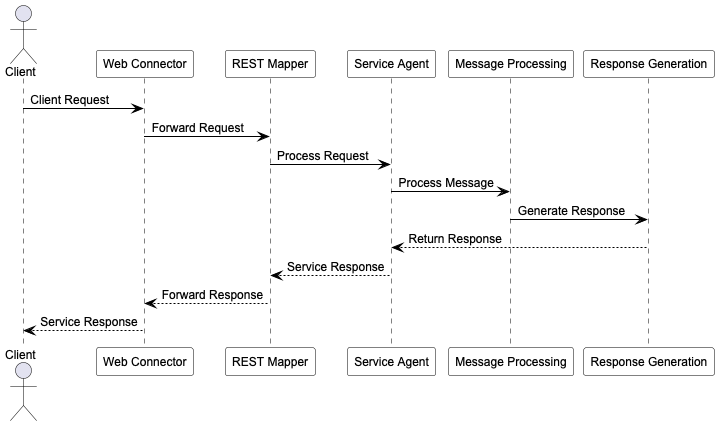
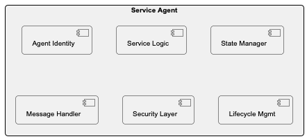

# las2peer Framework - Logical and Physical Architecture

## 1. Logical Architecture

### 1.1 System Layers



### 1.2 Layer Responsibilities

| Layer                 | Components                          | Primary Functions                                       |
|-----------------------|-------------------------------------|---------------------------------------------------------|
| **Application Layer** | Web Apps, Mobile Apps, Desktop Apps | User interfaces, client-side logic, service consumption |
| **Service Layer**     | Service Agents                      | Business logic, service implementation, data processing |
| **Framework Layer**   | Web Connector, REST Mapper, Core    | HTTP handling, message translation, agent management    |
| **Network Layer**     | FreePastry P2P                      | Node discovery, message routing, network maintenance    |

### 1.3 Component Interactions

**Vertical Communication Flow:**

- Applications → Service Agents → Framework Modules → P2P Network
- HTTP/WebSocket requests translated to P2P messages
- Service responses propagated back through layers

**Horizontal Communication Flow:**

- Service-to-Service communication via message passing
- Agent-to-Agent direct communication through envelopes
- Cross-node service discovery and invocation

### 1.4 Data Flow Architecture



### 1.5 Service Agent Architecture



### 1.6 Message Flow Patterns

**Request-Response Pattern:**

```
Client → REST Mapper → Core → Service Agent → Processing → Response
```

**Publish-Subscribe Pattern:**

```
Publisher Agent → Core → Event Distribution → Subscriber Agents
```

**Direct Agent Communication:**

```
Agent A → Envelope Creation → P2P Network → Agent B → Envelope Processing
```

## 2. Physical Architecture

### 2.1 Network Topology

```
                    ┌─────────────────┐
                    │ Bootstrap Node  │
                    │   (Entry Point) │
                    └─────────┬───────┘
                              │
            ┌─────────────────┼─────────────────┐
            │                 │                 │
    ┌───────▼─────────┐ ┌─────▼─────┐ ┌───────▼─────────┐
    │   Service Node  │ │Relay Node │ │   Service Node  │
    │ ┌─────────────┐ │ │           │ │ ┌─────────────┐ │
    │ │Service A,B,C│ │ │  Routing  │ │ │Service D,E,F│ │
    │ └─────────────┘ │ │   Only    │ │ └─────────────┘ │
    └─────────────────┘ └───────────┘ └─────────────────┘
            │                 │                 │
    ┌───────▼─────────┐ ┌─────▼─────┐ ┌───────▼─────────┐
    │   Client Node   │ │Relay Node │ │   Client Node   │
    │   (Consumer)    │ │           │ │   (Consumer)    │
    └─────────────────┘ └───────────┘ └─────────────────┘
```

### 2.2 Node Types and Deployment

| Node Type          | Purpose             | Requirements                  | Capabilities                           |
|--------------------|---------------------|-------------------------------|----------------------------------------|
| **Bootstrap Node** | Network entry point | High availability, static IP  | Node discovery, initial routing        |
| **Service Node**   | Host services       | Java 17, sufficient resources | Service execution, data storage        |
| **Relay Node**     | Message routing     | Stable connection, bandwidth  | Message forwarding, network stability  |
| **Client Node**    | Service consumption | Basic connectivity            | Service access, lightweight operations |

### 2.3 Infrastructure Components

**Hardware Requirements:**

| Component   | Minimum   | Recommended | Enterprise          |
|-------------|-----------|-------------|---------------------|
| **RAM**     | 2GB       | 8GB         | 16GB+               |
| **CPU**     | 1 core    | 4 cores     | 8+ cores            |
| **Storage** | 10GB      | 100GB       | 500GB+              |
| **Network** | Broadband | High-speed  | Dedicated bandwidth |

**Software Stack:**

```
┌─────────────────────────────────────────────────────────────────┐
│                    Operating System                             │
│            (Windows, Linux, macOS)                              │
└─────────────────────────────────────────────────────────────────┘
┌─────────────────────────────────────────────────────────────────┐
│                  Java Runtime 17+                               │
└─────────────────────────────────────────────────────────────────┘
┌─────────────────────────────────────────────────────────────────┐
│                  las2peer Framework                             │
│  ┌─────────────────┐  ┌─────────────────┐  ┌─────────────────┐  │
│  │      Core       │  │  REST Mapper    │  │  Web Connector  │  │
│  └─────────────────┘  └─────────────────┘  └─────────────────┘  │
└─────────────────────────────────────────────────────────────────┘
┌─────────────────────────────────────────────────────────────────┐
│                    FreePastry Library                           │
└─────────────────────────────────────────────────────────────────┘
```

### 2.4 Deployment Patterns

#### 2.4.1 Single Node Deployment

```
┌─────────────────────────────────────────────────────────────────┐
│                    Development Node                             │
│  ┌─────────────────┐  ┌─────────────────┐  ┌─────────────────┐  │
│  │  Web Connector  │  │  REST Mapper    │  │      Core       │  │
│  └─────────────────┘  └─────────────────┘  └─────────────────┘  │
│  ┌─────────────────┐  ┌─────────────────┐  ┌─────────────────┐  │
│  │   Service A     │  │   Service B     │  │   Service C     │  │
│  └─────────────────┘  └─────────────────┘  └─────────────────┘  │
└─────────────────────────────────────────────────────────────────┘
```

- Development and testing environment
- All modules on one machine
- Local service hosting and testing

#### 2.4.2 Multi-Node Cluster

```
┌─────────────────┐    ┌─────────────────┐    ┌─────────────────┐
│   Node 1        │    │   Node 2        │    │   Node 3        │
│ ┌─────────────┐ │    │ ┌─────────────┐ │    │ ┌─────────────┐ │
│ │ Service A   │ │◄──►│ │ Service B   │ │◄──►│ │ Service C   │ │
│ │ Service D   │ │    │ │ Service E   │ │    │ │ Service F   │ │
│ └─────────────┘ │    │ └─────────────┘ │    │ └─────────────┘ │
└─────────────────┘    └─────────────────┘    └─────────────────┘
```

- Production environment
- Load distribution across nodes
- High availability and fault tolerance

#### 2.4.3 Geographically Distributed

```
┌─────────────────┐    ┌─────────────────┐    ┌─────────────────┐
│   US Region     │    │  Europe Region  │    │   Asia Region   │
│                 │    │                 │    │                 │
│ ┌─────────────┐ │    │ ┌─────────────┐ │    │ ┌─────────────┐ │
│ │ Node Cluster│ │◄──►│ │ Node Cluster│ │◄──►│ │ Node Cluster│ │
│ └─────────────┘ │    │ └─────────────┘ │    │ └─────────────┘ │
└─────────────────┘    └─────────────────┘    └─────────────────┘
```

- Global service deployment
- Regional node clusters
- Optimized routing and latency

#### 2.4.4 Hybrid Cloud-P2P

```
                        ┌─────────────────┐
                        │   Cloud Tier    │
                        │ ┌─────────────┐ │
                        │ │Stable Nodes │ │
                        │ └─────────────┘ │
                        └─────────┬───────┘
                                  │
        ┌─────────────────────────┼─────────────────────────┐
        │                         │                         │
┌───────▼─────────┐       ┌───────▼─────────┐       ┌───────▼─────────┐
│   Edge Tier     │       │   Edge Tier     │       │   Edge Tier     │
│ ┌─────────────┐ │       │ ┌─────────────┐ │       │ ┌─────────────┐ │
│ │ Local Nodes │ │       │ │ Local Nodes │ │       │ │ Local Nodes │ │
│ └─────────────┘ │       │ └─────────────┘ │       │ └─────────────┘ │
└─────────────────┘       └─────────────────┘       └─────────────────┘
```

- Cloud nodes for stability
- Edge nodes for proximity
- Dynamic load balancing

### 2.5 Network Communication

#### 2.5.1 Message Routing

- **DHT-based Service Discovery**: Distributed hash table for efficient service location
- **Efficient Message Routing**: FreePastry's optimized routing algorithms
- **Automatic Network Topology Optimization**: Self-organizing network structure

#### 2.5.2 Security Layer

- **End-to-end Encryption**: All communications encrypted using envelope system
- **Certificate-based Authentication**: X.509 certificates for node identity verification
- **Secure Envelope System**: Cryptographic containers for sensitive data transmission

#### 2.5.3 Performance Optimization

- **Connection Pooling**: Reuse of network connections for efficiency
- **Message Compression**: Bandwidth optimization through data compression
- **Caching Strategies**: Multiple cache layers for frequently accessed services
- **Load Balancing**: Automatic distribution of requests across available service instances

### 2.6 Monitoring and Management

#### 2.6.1 Network Health Monitoring

```
┌─────────────────────────────────────────────────────────────────┐
│                  Monitoring Dashboard                           │
│  ┌─────────────────┐  ┌─────────────────┐  ┌─────────────────┐  │
│  │ Node Status     │  │ Service Health  │  │ Network Metrics │  │
│  └─────────────────┘  └─────────────────┘  └─────────────────┘  │
│  ┌─────────────────┐  ┌─────────────────┐  ┌─────────────────┐  │
│  │ Traffic Analysis│  │ Error Tracking  │  │ Performance     │  │
│  └─────────────────┘  └─────────────────┘  └─────────────────┘  │
└─────────────────────────────────────────────────────────────────┘
```

#### 2.6.2 Administrative Controls

- **Node Management**: Start, stop, restart, and configure nodes remotely
- **Service Deployment**: Deploy, update, and retire services across the network
- **Security Management**: Certificate management and access control policies
- **Performance Tuning**: Resource allocation and optimization settings
